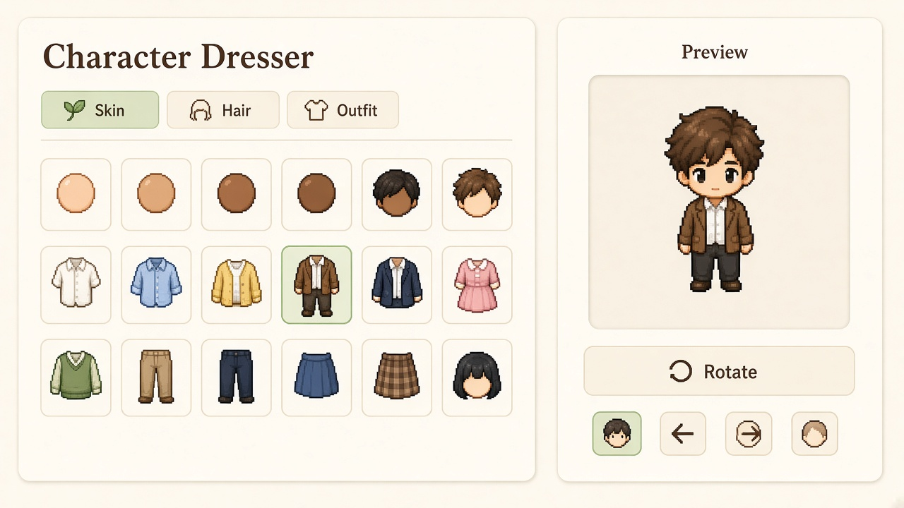
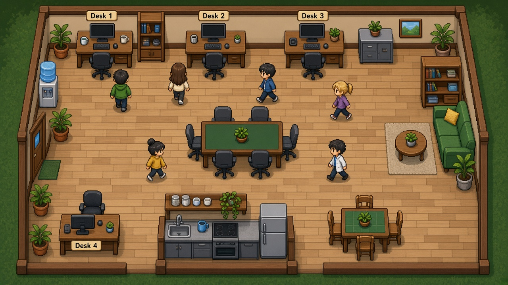
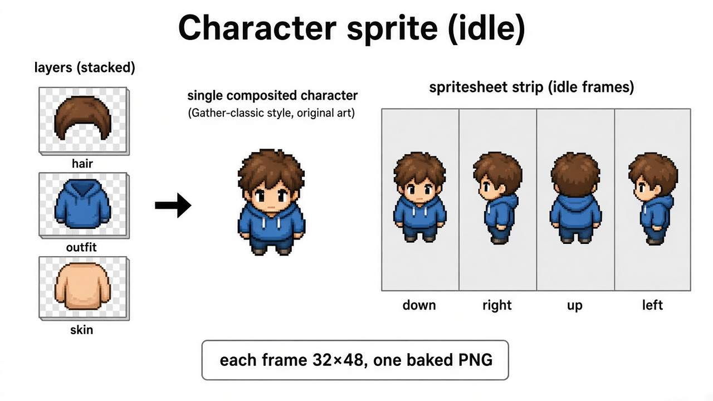
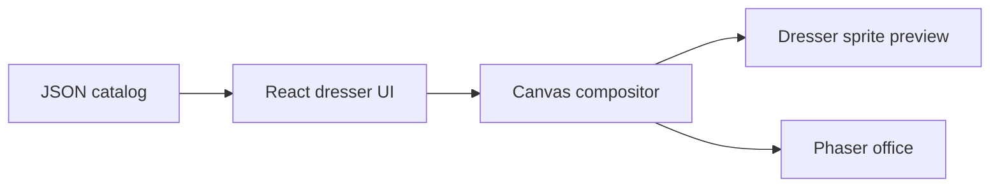

# Customized Virtual Character and Office

We want to create a virtual office where people can customize their character and their desk, and walk around inside the space. Inspired by [Gather](https://www.gather.town/get-started).

The visual language is chibi pixel-art illustration: large head, four facings (down, right, up, left), simple faces, clear outlines. The office sits on a **32×32** tile grid. Dresser art is stored at full illustration resolution (currently **440×935**) with a transparent background; the office can downsample that baked sprite later.

## Main features

The product has two parts: a **character dresser** and a **virtual office**. The look you pick in the dresser is the same sprite that walks around the office.

### 1. Character dresser

A page where you pick a look and preview it in your personal wardrobe.



- **Layout.** Left pane: equipment catalog. Right pane: character preview.
- **Categories.** Skin, Hair, Outfit. Clicking a thumbnail equips that slot immediately.
- **Outfit as one set.** One clothing layer includes top, bottom, and shoes. Users pick a full look such as “Business casual” or “Hoodie set”.
- **Skin.** Base body / skin-tone layer. Extra tones can be recolors of one body.
- **Hair.** Hair sits above the outfit. Long hair that shows behind the body can be split into `hairBack` + `hairFront` internally; the user still sees one Hair category.
- **Rotate.** Cycle facing: down → right → up → left. Left can be a horizontal flip of right when the art is symmetric.
- **Preview.** Clothes are stored as layered PNGs. On screen we draw **one sprite**, so the dresser and the office share the same character.
- **Save.** The current look is saved and reused when the character enters the office.

Layer order: 

1. Hair back (only when the style needs it)
2. Skin / body
3. Outfit (full clothing set)
4. Hair front


### 2. Virtual office

A 2D office map you can walk around. Each person has a character and a desk.



- **Office map.** A top-down 2D office on a 32×32 tile grid.
- **Walk around.** Move through rooms, desks, and meeting areas with the dressed character.
- **Personal desk.** Everyone has a workstation they can customize.
- **Meet others.** Multiple people can be in the same office at the same time.

---


## Technical selection


### Application stack

- **Dresser UI:** Vite + React + TypeScript. This page is a catalog + preview, not a game loop.
- **Office:** Phaser 3 + Tiled. Phaser handles the tilemap, camera, walking, and collisions.
- **Catalog:** JSON items (`id`, `slot`, `name`, `thumb`, frame paths). The UI does not hardcode wardrobe entries.
- **State:** `{ skin, hair, outfit, direction }`.
- **Dresser layout:** CSS / Tailwind.


### Rendering

Clothes stay as separate aligned PNGs (skin, hair, outfit). A small **Canvas 2D compositor** stacks those layers and bakes **one sprite**. The dresser preview shows that sprite. The office shows the same sprite on the map.

That is one character pipeline: the office plays the baked sprite, and does not restack clothes per player.



A sprite is a transparent PNG of the finished character. Dresser source frames are **440×935** (cropped from 864×1152 illustration canvases), with a shared feet origin.


| Anim | Frames               | Layout                                    |
| ---- | -------------------- | ----------------------------------------- |
| Idle | 1 frame × 4 facings  | four files, or one strip           |
| Walk | 4 frames × 4 facings | same cell size, extra frames in the strip |


| down     | right    | up       | left                                          |
| -------- | -------- | -------- | --------------------------------------------- |
| 440×935  | 440×935  | 440×935  | 440×935 (flip of right if the art is symmetric) |





### Character data

```ts
type Direction = "down" | "up" | "left" | "right"
type Slot = "skin" | "hair" | "outfit"
type Anim = "idle" | "walk"

interface Item {
  id: string
  slot: Slot
  name: string
  thumb: string
  frames: Record<Anim, Record<Direction, string | string[]>>
}

interface Loadout {
  skin: string
  hair: string
  outfit: string
  direction: Direction
}
```

Asset layout: `asset/{skin|hair|clothes}/{id}/{anim}_{direction}.png` (or `{anim}_{direction}_{frame}.png` for walk). Transparent PNG, shared feet origin. Catalog thumbs show the item only (skin circle, hair, clothes), not a posed full character. Draw `down`, `up`, and `right`; derive `left` by flip unless a piece is asymmetric.

### Art pipeline

- Style: Gather Classic–like chibi pixel. Match the genre; do not copy Gather assets.
- Tools: Aseprite (or LibreSprite / Piskel).
- Clothes are full outfits, so artists keep one clothing layer in register, not shirt / pants / shoes separately.
- Recolor skin and hair with palette swap; do not redraw every color.

